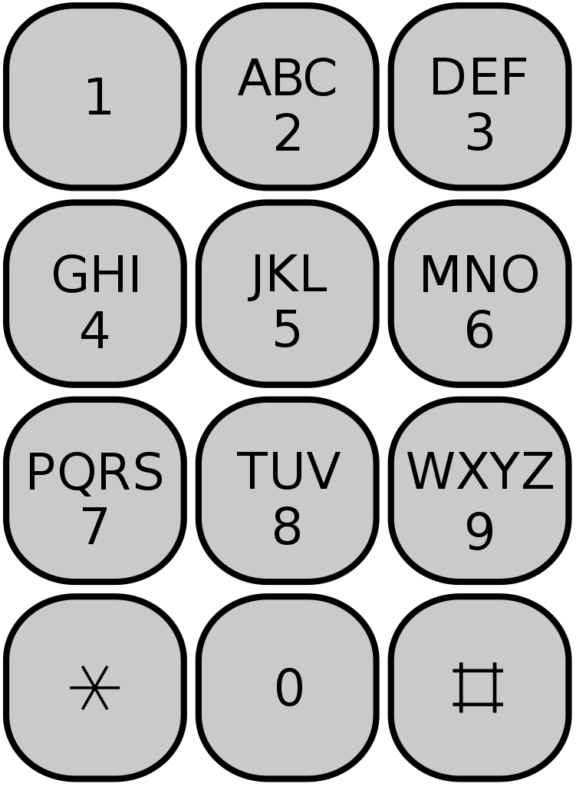
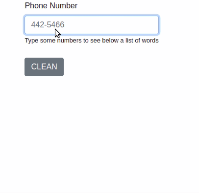

# Spelling With Phone Numbers

This an exercise project of mine. It consists of a server in NodeJs which handles logic and client in html and vanilla JS.

Every number typed on an input in the browser, corresponds to a combination of letters - like in the old mobile phones where each number corresponds to 3 or 4 letters. 

[](./phonekeyboard.png)

[](./typing_number.gif)

From the combinations generated it will look into a dictionary of English words and return to the page.

### Example:
- Input: 8733
- Output: ["tree","tref","urde","used","usee"]

### To run server locally
#### Pre-requisites:
- [Node](https://nodejs.org/en/)

```bash

# install server dependencies:
npm install

# run server
npm start

# check on browser:
http://localhost:3000
